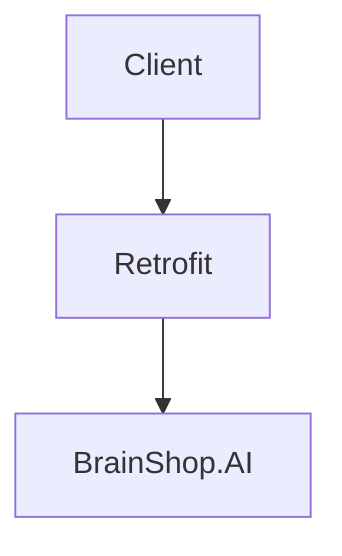

<p align="center">
  
</p>

# ChatBot-Using-BrainShop.AI

The name of the ChatBot is MuskBot. I am interested to do project with java and made the whole project with it and with the help of BrainShop.AI.
This MuskBot can reply to you and you can reply to MuskBot on the next occurence .

## How it works

First we have to code for backened and frontend then we have to integrate our project with brainshop.ai. This brainshop.ai is already a trainned model for creating
chatbots. we have to use another api called retrofit for converting client side messages to json format and searches in brainshop.ai like REST api and displays output.

Here is a simple flow chart:



### Dependencies for Retrofit

```
implementation 'com.squareup.retrofit2:retrofit:2.9.0'
implementation 'com.squareup.retrofit2:converter-gson:2.5.0'
```

## Sample Conversation

<p align="center">
  
</p>


